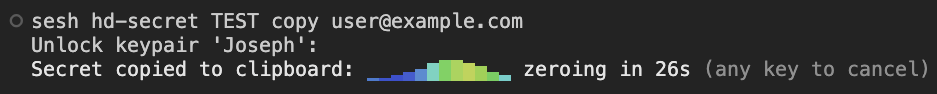

# sesh - Shared Encrypted Secret Hierarchy

<p align="center">
  
</p>

*Sesh is a **keysafe**: it manages everything a password safe does (passwords,
PINs, cryptographic keys, BIP39 mnemonics, authenticator (2FA) secrets), but
it derives them on demand from a single master secret instead of storing them,
for yourself or shared by a team.*

Small teams of users can create and maintain shared, replicated keysafes
without ever transmitting secret information. It works by establishing
**2- and 3-party shared secrets** over an insecure channel using
**BLS12-381**, backed by an **encrypted local keystore**.

There is only one master secret stored per keysafe. Everything else
(secretes, shared-secrets and passwords) is hierarchically and
deterministically (HD) derived (only when needed) from the master secret. This
approach has many advantages, in addition to never transmitting secrets.

Sesh keysafes only needs a single initial backup, unless the corresponding
keypair's secret was initialised from a mnemonic, in which case no backup is
required. In both scenarios, subsequent backups are not required when passwords
are created or updated (more on this later).

For convenience sesh provides full backup and restore functionality for master
secrets and their corresponding metadata, and also a decentralized secret-share
keysafe backup mechanism that works without transmitting secrets. Mnemonic
master secrets are not backed up by sesh, but their corresponding metadata can be.

For the decentralized shared-secret backup the group's master `K` is
derived from the members' setup tokens and stored nowhere.  Consequently, it can
be derived privately by the the group's members and `sesh shared-secret export`
doesn't need to export it (see [Two kinds of backup](#two-kinds-of-backup)).

Shared secrets work like this:
* **2-party** uses plain ECDH in `G1` (`ab * G1`).
* **3-party** uses the one-round, non-interactive **[Joux]** key agreement: the
  symmetric pairing element `e(G1,G2)^{abc}`, computed by each party from the
  other two public keys alone (**no combiner, no message rounds**).
* Both are turned into the output secret by a deterministic, unbiased
  hash-to-scalar, so all parties agree bit-for-bit.

An **identity** is a single encrypted *seed*. Two domain-separated subkeys are
derived from it: a DH/Joux scalar and a BLS signing scalar. One identity fans
out to many named shared-secrets.

[Joux]: https://link.springer.com/chapter/10.1007/10722028_23

## How trust works

1. **Contacts.** You pin each users's long-term public identity once, over a
   secure channel, under a local alias (`bob`, `alice`). The pinned value *is*
   the ground truth. Re-pinning the same key is a no-op; pinning a *different*
   key under an existing alias is not allowed.
2. **Per-group signed child keys.** Each shared secret uses a *per-group* DH
   subkey derived from your seed and bound to the group's agreed name and exact
   membership (`group_ctx`), signed by your long-term identity. Two groups with
   the same members but different names yield different secrets, and a member who
   disagrees on the name or membership simply refuses to join, preventing the
   group from being formed. This gives provable per-group consent / anti-enrollment.
3. **Setup tokens.** Setup tokens contain no secret keys, but convey the name
   of group and the public keys of the group members.  For privacy, instead of
   transmitting the raw information, each party emits one compact base58 encoded
   setup token. Its checksum catches copy-paste typos before any cryptography runs
   and is not a tamper defense.  Tamper resistance is instead provided with
   encryption and cryptographic signatures. Each token body is encrypted under a
   key each member derives from its own long-term DH secret and the other members'
   pinned public keys (a shared DH/Joux value) so setup tokens may cross insecure,
   untrusted channels without leaking the group name or the child pubkeys, and an
   outsider cannot even generate a token that decrypts.

## Security model

- **The trust anchor is the users' long-term keys.** Each peer's pinned public
  identity (rooted in their secret key) is the ground truth from which all
  authenticity flows, signatures and the derived wrap/agreement keys. Sharing and
  pinning the authentic public keys requires a secure, out-of-band channel once.
- **Setup and share tokens are encrypted end-to-end.** A setup token is sealed
  under the members' long-term DH/Joux key; a **share token** (hd-secret sync)
  is sealed under the group secret `K`, with only the routing `group_ctx` left
  in the clear. Both are sign-then-encrypt, so an eavesdropper on the insecure
  channel learns neither the recipe (id/user/epoch/params) nor who authored it.
- **Every incoming point is subgroup-validated.** (BLS12-381 has cofactor != 1):
  on-curve, in the prime-order subgroup, and non-identity. 3-party child pairs
  are additionally consistency-checked, and any child key equal to a member's
  long-term identity key is rejected (child-key disjointness).
- **The derived secret `K` is never stored, and never leaves the keystore.** A
  groups shared secret is alwaus re-derived from the seed plus public state,
  and used only as the master keying a group's `hd-secret` layer. `K` has no
  output command at all; the only secrets that ever leave sesh are managed
  **hd-secret leaf** children, and only through two supervised commands: `copy`
  and `reveal` (see *Usage*). The keypair secret is encrypted at rest with
  **AES-256-GCM** under an **Argon2id** key; files are permissioned with
  `0600`, directories `0700` (Unix).
- **There is no forward secrecy.** (forced by re-derivability): a secret
  compromise is total from that level down.
- **There are no group passwords.** Each user's kerypairs are protected by
  independent keypair passwords, which is strictly stronger that a shared
  group password and needs no coordination.
- **Rotation / domain separation is the HD layer** (`hd-secret`), not a
  per-group salt.
- **Whole-keystore backup/restore** (`sesh backup <file>` / `sesh restore
  <file>`) produces a single AES-256-GCM + Argon2id encrypted bundle under an
  independent backup passphrase, and refuses to overwrite a non-empty keystore
  without `--force`. A mnemonic-derived keypair's seed is deliberately left out
  of the bundle (you already hold it as 24 words) so `restore` prompts for
  each one, and lets you skip it. Restore is not transactional: a *wrong*
  mnemonic is caught before the target is touched, and because the bundle stays
  the source of truth, `restore --force` is idempotent and re-runnable.
- **Decentralized group backup** (`sesh shared-secret export <group> <file>` /
  `sesh shared-secret import <file> --keypair <name> --party <alias>...`) seals a
  group and its whole hd-secret registry under the *membership's* static DH/Joux
  key: no passphrase, no new secret, nothing extra to lose. Sign-then-encrypt,
  so an eavesdropper cannot even attribute the file; membership-exact, so the
  wrong `--party` set is an AEAD failure rather than a subtly wrong result. It
  carries no seed, no `K`, and no password. No forward secrecy: it is as
  sensitive as the group's setup tokens.

## Build

```console
$ cargo build --release
$ cargo test
```

### Keystore location

By default the keystore lives at `~/.sesh`, created automatically on first use.
To keep it elsewhere, e.g. on a removable device, create
`~/.config/sesh/config.toml` containing:

```toml
default_keystore_path = "/path/to/alternate/sesh/store"
```

If that path is a removable device, you can also set the optional
`default_keystore_id = "<uuid>"` (copy it from the store's `<keystore>/config.toml`)
so that sesh refuses a different keystore (e.g. from a different device
mounted at the same path). Sesh refuses a `config.toml` that is
group/world-writable or not owned by you because whoever edits that file redirects
where your secrets are written.  `$SESH_HOME` and the global `--keystore <dir>` flag
override the config file, in that order of precedence (flag first).

A keystore reached through `config.toml` is never auto-created.  If the path
is missing (e.g. device not mounted) sesh reports it and stops, rather than silently
writing secrets to the internal disk at that mount point. Provision such a store
once with `sesh --keystore <path> keypair create <name>` (with the device
mounted), then point `config.toml` at it.

The same file holds the user's settings ([`config.toml.example`](config.toml.example)
documents every key it accepts). It is optional, per-machine, and holds no
secret; an unknown key in it is an error, not a preference that silently never
applies.

### Tab completion

Sesh ships with dynamic shell completion: the completions are computed live by the
binary itself (`COMPLETE=<shell> sesh` prints the registration script), so
subcommands, flags, and entity names all complete, with nothing to regenerate
after an upgrade. `sesh` must be on your `PATH`.

To try it in the current shell:

```console
$ source <(COMPLETE=zsh sesh)     # zsh
$ source <(COMPLETE=bash sesh)    # bash
$ COMPLETE=fish sesh | source     # fish
```

To always have it enabled, add the same line to your shell's startup file:

```console
$ echo 'source <(COMPLETE=zsh sesh)'  >> ~/.zshrc                    # zsh
$ echo 'source <(COMPLETE=bash sesh)' >> ~/.bashrc                   # bash
$ echo 'COMPLETE=fish sesh | source'  >> ~/.config/fish/config.fish  # fish
```

Zsh only: the registration script calls `compdef`, which exists only after
zsh's completion system is initialized. If you see `command not found:
compdef`, add `autoload -Uz compinit && compinit` to `~/.zshrc` **before** the
`source` line (frameworks like oh-my-zsh already do this). Bash and fish need
nothing extra: `complete` is a bash builtin, and fish's completion system is
always on.

Completion only ever offers names that are already plaintext on disk (keypair,
contact, and group names). hd-secret ids live inside an encrypted registry and
are deliberately **not** completable: completion runs on every tab press and
must never prompt for a password, and the ids' confidentiality should not
depend on a shell convenience.

## Usage

Entity names are positionals throughout, and running any family bare
(`sesh keypair`, `sesh hd-secret`, ...) prints its help. `show` prints labeled
details and **never** a secret. Only managed **hd-secret leaf** secrets ever
leave sesh, and only through two supervised commands:

- `hd-secret copy ...` - the secret goes to the system clipboard, never echoed,
  then a countdown zeros it;
- `hd-secret reveal ...` - the secret is shown on screen in a timed, supervised
  window (TTY only; see *Names, clipboard, cascades*).

A stored group's master `K` and every identity seed have **no** output command
at all. `--mode` appears on `create` and `rotate`, the commands that set a
definition's recipe.

### 1. Each party creates an identity and shares its contact token

```console
$ sesh keypair create alice            # Prompts for a keypair password
Name:          alice
Fingerprint:   4XkTeGVLnn6
Contact token: 2Rz...                  # Share this over a secure channel
Private key:   v1, encrypted, 32 bytes
Seed origin:   random (not in any mnemonic, backups carry it)
```

The `create` command creates the keypair and prints the same labeled block
as `show`. The optional `--mnemonic` prompts for a 24-word BIP39 mnemonic and
uses its 256 bits of entropy as the seed. This allows your bring your own
from a hardware wallet, dice, or another tool. It is a **flag and takes no
value** (`sesh keypair create <name> --mnemonic`, never
`--mnemonic "<24 words>"`) because a phrase on the command line is recorded in
your shell history and visible in the process list. Otherwise, it generate a random
keypair using cryptographically strong entroy. A random-seed keypair recovers via
`backup`/`restore` and a mnemonic keypair is recovered by re-entering the
mnemonic and associated metadata for the shared-secrets and hd-secrets.

To change a keypair's password, use `sesh keypair password <name>`. It prompts
for the current password, then the new one twice, and re-encrypts the seed in
place with a fresh salt and nonce.

### 2. Pin each peer as a contact

A peer/user's contact token carries its owner's name, so pinning is one paste;
`--name` overrides the alias (e.g. when two peers picked the same name):

```console
$ sesh contact add 2Rz...                # Pins under the token's embedded name
                                         # then prints the fingerprint + pinned token
$ sesh contact add 9kP... --name alice2  # Pins under a different local alias
$ sesh contact show alice                # Show's name, fingerprint, pinned token
$ sesh contact list
```

N.B. putting the contact token on the command-line is optional, the better way is
interactively, like so.

```console
sesh add
Peer contact token: 2Rz...
```

### 3. Create a shared secret

**Interactive wizard** (default on a terminal):

```console
$ sesh shared-secret create OurGroup --keypair carol --party bob --party alice
```

The wizard shows your token, then walks you through pasting each peer's setup token.
Every check (paste integrity, group name, signature against the pinned contact)
explains itself and re-prompts on failure and the wizard ends by confirming the
agreement checksum before storing the shared secret metadata (no secret is stored!).

**Two-phase, non-interactive** (scripting): each party first emits its token, then
completes once it holds every peer's token (one `--token` per `--party`, in
matching order):

```console
# Phase 1 - Everyone shares their token
$ sesh shared-secret create OurGroup --keypair carol --party bob --party alice --emit-token
Your setup token: 3Fh...

# Phase 2 - Everyone completes
$ sesh shared-secret create OurGroup --keypair carol --party bob --party alice \
      --token <bob's> --token <alice's>
...
```

Every party ends with the **same checksum**, confirming they agree. Only public
state is stored and never `K`, which stays in the keystore as the group's HD
master and is re-derived on demand.

N.B. `show` is metadata-only in both families. `shared-secret show` prints the
group's public details; `hd-secret show ...` prints the entry's params plus the
derived secret's fingerprint.

### 4. Derive HD child secrets

`hd-secret` is a password-manager layer over a master secret, addressed by its
**owner**: a keypair name (master = its DH scalar) or a shared-secret group
name (master = `K`), where the name resolves automatically. Secret values are
never stored: the registry keeps only *definitions* (`id`, optional `user`,
an `epoch` version, and formatting params), encrypted at rest under the owning
keypair, and every secret is re-derived on demand.

```console
$ sesh hd-secret create alice google.com bob@google.com
$ sesh hd-secret list alice                         # Shows table of public info, never secrets
$ sesh hd-secret show alice google.com              # Show's entry details + fingerprint (only public info)
$ sesh hd-secret copy alice google.com              # Copy a secret -> clipboard, never echoed
                                                    #   then a live countdown zeros it.
$ sesh hd-secret reveal alice google.com            # Show a secret on screen, timed window (TTY only)
                                                    #   then a live countdown zeros it.
$ sesh hd-secret rotate alice google.com --mode hex # Re-shape it (new epoch -> new secret)
$ sesh hd-secret rotate alice google.com            # Secret rotation: bump epoch -> new secret
$ sesh hd-secret remove alice google.com            # Remove a secret (epoch-versioned tombstone)
```

A definition renders exactly one way: the way its stored params say.  Thus, a
fingerprint attests the exact string `copy` will produce and not merely the
child behind it. Re-shaping one is a `rotate` with new params, which advances the
epoch, so the secret changes with the shape.

The `--mode` (`hex`/`b58`/`b10`/`alpha`/`bip39`/`otp`), `--length`, `--symbols`,
and `--suffix` format the output only.  They never enter the derivation, so
agreeing on `(id, user, epoch)` and params reproduces the same string anywhere.

A bare `create` defaults to `--mode b58 --length 14 --symbols`: a short,
memorable, symbol-bearing password. The defaults are **resolved once and stored**
in the definition's params, and every command that displays a definition
(`create`, `show`, `rotate`, `list`, `apply`) prints **all four** of them back,
including the ones you never typed and the ones that are off:

```console
Params:  --mode b58 --length 14 --symbols='!@#$%^&*()-_=+[]{}:;,.?' --suffix none
Params:  --mode alpha --length none (78 chars) --no-symbols --suffix none
```

An untrimmed recipe is annotated with the length it actually renders to, since
`--length none` says there is no trim but not how long the password is. It is
shown in parentheses rather than as a bare `--length 78` because it is an
observation about *this* epoch, not part of the recipe: `b10`/`b58`/`alpha`
encode the secret as a big number, so the natural length drifts with the value.

So a reader always sees exactly what the password is supposed to look like,
without having to know what this build's defaults happen to be. Since the
resolved values are what is stored, and `rotate` merges over the *stored* params
rather than re-applying today's defaults, a later change to the built-in defaults
can never alter an existing password. The `--length` and `--symbols`
defaults are per-mode: `hex` and `b58` get `--length 14 --symbols`, while
`b10` is a numeric code, so a bare `--mode b10` resolves `--length 6
--no-symbols` (a PIN, pass `--length`/`--symbols` explicitly for more);
under `--mode alpha`, `--mode bip39`, or `--mode otp` neither is filled in, so
you get the full case-code, the full 24-word mnemonic, or the full TOTP secret
(see [§5](#5-team-totp-shared-two-factor-codes---mode-otp)). Use `--no-symbols`
to opt out of the symbol set. Rotating an existing definition into a mode that
cannot render a carried-over param (`--mode alpha` with a symbol set, `--mode
bip39` or `--mode otp` with a length or suffix) simply drops it, naming each
drop on stder. Asking for both at once (`--mode alpha --symbols`) is still an
error.
The `--symbols` option extends the alphabet with extra characters (positional
modes `hex`/`b10`/`b58` only), so they are distributed uniformly through the
password rather than clumped at the end.  In particular, the placement is driven
by the secret's own bits, so it stays fully deterministic. Bare `--symbols` uses
a built-in default vocabulary of common, verifier-friendly symbols
(`!@#$%^&*()-_=+[]{}:;,.?`); `--symbols='<set>'` names your own. The set's length
and order are part of the recipe, so the resolved set is what gets stored. A
later change to the default cannot silently alter an existing password. A custom
set must be printable ASCII, free of repeats, and disjoint from the mode's own
alphabet (so `--symbols=1` is refused under `b58`, and `--symbols=a` under
`hex`); it need not be punctuation, and `hex` loses its `0x` prefix when one is
given. `--suffix` still appends a *fixed* string
to the end (and the two compose). Note that `b10`/`b58`/`alpha` render the secret
as a big number, so the string's length varies slightly with the value
(a requested `--length` left-pads with the mode's zero digit when needed) and
the *leading* character is not uniformly distributed. A trimmed password carries
marginally less entropy per character than `hex` of the same length.
This costs only a fraction of a bit overall.

Every managed secret is inventoried: there is no ad-hoc, untracked derivation.
To reproduce a secret elsewhere (e.g. after recovering a keypair), recreate the
definition with the same `(id, user)` and formatting params and `rotate` to the
right epoch.  That is, `create`/`rotate` with optional `--recover <epoch>` is
the sanctioned recovery path.

**Group sync.** Changes to *group-owned* definitions travel as signed,
group-bound **share tokens** with no secret material, just the recipe.
`create`/`rotate`/`remove` print one automatically; re-emit any time with
`share`. Other members import them:

```console
$ sesh hd-secret apply <share-token>   # Apply an keysafe update, where
                                       #   the token identifies the group automatically
$ sesh hd-secret share OurGroup vpn    # Re-share a stored entry (no secret transmitted)
```

N.B. putting the contact token on the command-line is optional, the better way is
interactively, like so.

```console
sesh hd-secret apply
Share token: <share-token>
```

`apply` adopts a newer epoch, ignores a stale one, and on a same-epoch
conflict (concurrent edits) shows **both** versions (params and fingerprints)
and asks *keep mine / use incoming / abort*. A removal is a tombstone, so a stale
`create` cannot resurrect it. Tokens are rejected for any other group (context-bound)
and for any non-member signer.

### 5. Team TOTP: shared two-factor codes (`--mode otp`)

`--mode otp` turns an hd-secret into a standard **TOTP** authenticator secret
(RFC 6238: the 6-digit codes every authenticator app produces). `reveal` shows
the live rolling code, `copy` puts the current code on the clipboard, and
`--setup` gives the one-time enrollment view: the Base32 secret, the
`otpauth://` URI, and a scannable QR code.

Prefer `reveal --setup` (scan the QR) over `copy --setup`: a code is stale in 30
seconds, but the enrollment URI is the seed itself, a long-term secret, and
clipboard-history tools may keep a copy of it after sesh has zeroed the
clipboard.

Motivating example: three admins share root access to a server whose SSH logins
are 2FA-gated by PAM. Normally that means generating a TOTP seed and passing it
around, i.e. via a screenshot of a QR code or a shared vault-- a dangerous and
error-prone process! With a group-owned otp secret, no teammate ever handles the
seed. Only the server being enrolled sees it:

```console
$ sesh hd-secret create ourteam ssh-root --mode otp   # any member: peers sync via the share token
$ sesh hd-secret reveal ourteam ssh-root --setup      # one member: enrolls the server (Base32/QR)
$ sesh hd-secret apply ourteam                        # every member: inputs share token
$ sesh hd-secret copy ourteam ssh-root                # every member: current code -> clipboard
```

For a team this composes into something no authenticator app offers:

- **The secret is never shared among members.** Each derives the identical
  TOTP seed independently from the group secret; enrollment hands it only to
  the verifier you're protecting, never to a teammate.
- **Everyone is always current.** Same derivation, same clock, same code, on
  every member's machine, forever, with nothing to distribute or refresh.
- **Rotation shares no secrets either.** `rotate` bumps the epoch; the share
  token carries only the recipe, and each member re-derives the new seed.
- **Backup is automatic.** Codes re-derive from the master (or your 24-word
  mnemonic), so there are no authenticator backup files and no cloud sync to
  trust.

The catch is inherent to TOTP: third-party sites (GitHub, Google, ...) generate
the seed on their side and won't accept yours. Derived otp secrets are for
**verifiers you control**, i.e. anything that accepts a supplied seed,
including:

- PAM `google-authenticator` (SSH/sudo 2FA: the Base32 secret is the first line
  of `~/.google_authenticator`)
- HashiCorp Vault's TOTP secrets engine (`generate=false` takes the `otpauth://`
  URI verbatim)
- FreeIPA (`ipa otptoken-add --ipatokenotpkey=<base32>`)
- privacyIDEA / LinOTP and similar enterprise OTP servers (seed-import
  enrollment)
- self-written services via any RFC 6238 library

 The same `--setup` view can also be used to load the seed into an ordinary
 authenticator app or hardware key (scan the QR, or `ykman oath accounts uri`
 for a YubiKey), so your phone shows the same codes sesh does. It is a convenience
 copy, not a backup: it re-derives from the master like everything else.

## Two kinds of backup

`sesh backup` is the *centralized* one: an encrypted bundle of your whole
keystore under a passphrase you choose. It protects against a dead disk. It does
not protect against a dead disk **and** a forgotten passphrase.

`sesh shared-secret export` is the *decentralized* one. Any member of a group can
hand any other member a single file that restores the group's master secret and
every password recipe in it: live, rotated, and removed. It is encrypted to the
group's membership, so only members can open it, and it is safe to send over an
unencrypted channel.

There is no passphrase, because there is no new secret. The key is
`setup_wrap_key`: the static multiparty DH/Joux value over the identity keys the
members already pinned in each other's keystores (`s_a * s_b * G1` for two parties,
`e(G1,G2)^{s_a * s_b * s_c}` for three), with the sorted membership hashed in. Every
member derives it; nobody else can. The only things you must still hold are your
own 24-word mnemonic and your peers' contact tokens, both of which you can get
back from a peer, a hardware wallet, or a piece of paper.

The file contains no seed, no group master, and no password. It cannot be used to
derive anything without a member's own seed: `K` comes from
`derive_group_key(my_child_scalar(my_seed, ctx), peer_tokens)`, and the first
argument is not in the file.

```sh
# bob, who still has the group:
sesh shared-secret export team ./team.export

# alice, starting from bare metal and 24 words:
sesh keypair create alice --mnemonic
sesh contact add <bob's contact token>
sesh contact add <carol's contact token>
sesh shared-secret import ./team.export --keypair alice --party bob --party carol
```

The pins are not a convention you could skip: without them the file does not
decrypt at all. And the export deliberately carries **no identity keys**. If it
did, and `import` pinned them, whoever handed you the file would choose your
group's membership, collapsing the out-of-band pin (Tier 1) into a signature
check against a key that arrived in the same envelope (Tier 2).

`import` verifies everything before it writes anything: the AEAD tag (integrity,
every member holds the wrap key, so this is not attribution), a BLS signature by
the exporter sealed *inside* the ciphertext (attribution, `Signed by 'bob'`), the
agreement checksum over `K` (the end-to-end confirmation that both sides derived
the same group master), and finally each definition's `hd_fingerprint`,
recomputed from the locally derived `K`. That last check is redundant given the
first three and ships anyway, as a tripwire for the class of bug that would
otherwise be silent.

The registry **merges**, epoch by epoch, exactly as `hd-secret apply` does: a
newer epoch is adopted, an older one is stale, and a same-epoch content
difference is a conflict `import` reports and skips rather than resolving. An
export is a snapshot of one member's registry, not group-wide truth, so importing
bob's export *and* carol's converges them.

What it does not have is **forward secrecy**: the keys are static, so a member's
seed leaking later decrypts every export ever sent. That is not a regression. The
group child derivation has none either, and setup tokens have always been pasted
over whatever channel the user had. It does mean the file is as sensitive as the
group's setup tokens, not as sensitive as a `backup` bundle.

The recovery threshold is 1-of-(N−1), and that is the correct threshold here: a
group member is *already* fully trusted. They hold `K`, they can derive every
password and they can author signed share tokens. There is no privilege for a
malicious exporter to escalate to. Matching the threshold to the trust the
protocol already extends is what lets this be a passphrase-free file instead of a
threshold ceremony.

## Fingerprints

`show` and `list` print a short base58 **fingerprint**:
`b58(SHA3-256(dst ‖ input)[..8])` over the canonical 192-byte public
identity for keypairs/contacts (so your `keypair show` fingerprint equals what
peers see in `contact show` for you), and over the public `group_ctx` for groups
(identical for every member, no password needed).

An hd-secret's fingerprint has **two halves**, `<recipe>-<secret>`, e.g.
`5kWagy-PkFbb1Euv4o`, because there are two things to agree on and they fail
separately. The trailing half covers the raw derived child scalar, so
mode/length/suffix don't change it: group members compare it to confirm they
hold the same secret. The leading half additionally covers the formatting
params, so it moves whenever the rendered password does. A mismatch therefore
says *which* thing diverged: differing tails mean different secrets, while
matching tails under differing heads mean one secret formatted two ways, which
is exactly the case where two members hold different passwords.

Neither half hashes the rendered password itself: that would be an unsalted,
unstretched password hash, putting a short one (`--mode b10 --length 8`) inside
a feasible search of any digest you printed. Both commit to the child scalar,
whose entropy is full however short the password it renders to.

Fingerprints are a **recognition aid, not a security boundary**. The pinned
contact token remains the ground truth, and the recipe half in particular is
short enough to grind for whoever authors a share token's params. They are
computed on the fly at display time; no registry or share token stores one.

## Names, clipboard, cascades

- **One namespace.** Keypair and group names must be distinct (so an
  hd-secret owner name resolves unambiguously), no entity may be named after a
  command word (`create`, `show`, `copy`, `list`, `rotate`, `remove`,
  `reveal`, `share`, `apply`, `new`, `add`, `help`) or start with `-`; all
  enforced at creation.
- **Clipboard.** `hd-secret copy ...` pipes the secret to the tool's stdin
  (never argv): `SESH_CLIPBOARD_CMD` if set (run via `sh -c`), else `pbcopy`
  (macOS), else `wl-copy` (Wayland) / `xclip -selection clipboard` (X11). On an
  interactive terminal, `copy` then shows a **zeroing countdown**: an animated
  colour spinner and a timer (`--timeout`, default 30s) that gives you time to
  switch apps and paste, then overwrites (zeros) the clipboard. **Any key**
  zeros immediately; both exit cleanly. Piped (non-interactive) `copy` skips the
  countdown.
- **Clear-on-paste (Linux).** X11 and Wayland clipboards are *request-served*:
  the copying process stays alive and hands the secret to each application that
  pastes, so it can count pastes and drop the selection after a budget of them.
  Set one in `~/.config/sesh/config.toml` (see [`config.toml.example`](config.toml.example)):

  ```toml
  linux_paste_count = 1
  ```

  The countdown still runs and still zeros on timeout or a keypress; the budget
  only lets the clipboard clear **earlier**, the moment you have pasted. Two
  caveats, both inherent to the mechanism: Wayland's `wl-copy` serves at most one
  paste (so only `1` works there; X11's `xclip` takes any count), and a clipboard
  *manager* that snapshots every selection consumes pastes exactly as an app
  does, so on such a desktop the budget can be spent before you paste at all.
  macOS has no equivalent, because `NSPasteboard` never reports a read; the
  setting is ignored there and the timed zeroing is what you get.
- **On-screen reveal.** `hd-secret reveal ...` shows the secret on the
  **alternate screen buffer** (no scrollback, vanishes on exit) with a
  countdown below it (`--timeout`, default 60s; **any key** clears immediately),
  wiping the region before it returns. The countdown runs with terminal signals
  disabled, so `Ctrl-C`, `Ctrl-Z` and `Ctrl-\` cancel it like any other key
  rather than killing or suspending the process with the secret still on screen
  and the terminal left in raw mode. It is **TTY-only by construction**
  (refused unless both stdin and stdout are terminals) so piping can never turn
  it into a plain dump. It is leak-*minimizing*, not leak-proof: a screen
  recorder or `tmux capture-pane` still sees what you chose to display.
- **Cascading removal.** Removing an entity removes everything reachable only
  through it, and prints each cascade: `keypair remove X` also removes the
  shared-secrets owned by `X` (their `K` needs X's seed); `contact remove C`
  also removes the shared-secrets with `C` as a member (their `K` needs C's
  pinned key). A cascaded group's registry lives inside its directory and goes
  with it.

## Keystore layout

```
~/.sesh/                              dir  0700   # or wherever the location resolves
  config.toml                         file 0600   # identity marker (id), stamped on first write
  keypairs/<name>/identity            file 0600   # seed encrypted; pubkeys plaintext
  keypairs/<name>/registry            file 0600   # personal hd-secret definitions, encrypted; no values
  contacts/<alias>/identity           file 0600   # pinned peer long-term pubkey (public)
  shared-secrets/<name>/state         file 0600   # keypair + group name + contact refs + peer tokens (no K)
  shared-secrets/<name>/registry      file 0600   # group hd-secret definitions, encrypted; no values
```

Secrets never appear on the command line and are never typed.  Every seed is
*generated* and lives only in the keystore. Passwords are read with no-echo;
seeds and passwords are held in zeroizing buffers, and the long-lived derived
masters (an identity's `s_dh`, a group `K`) are wrapped in a `SecretScalar` that
is scrubbed on drop. Zeroization is **best-effort**: `blstrs` scalars are `Copy`
and cannot implement `Zeroize` (orphan rule), so transient copies the code makes
in registers or on the stack are not tracked.

## License

Copyright (c) 2026 Joseph Spadavecchia.

Licensed under either of

- Apache License, Version 2.0 ([LICENSE-APACHE](LICENSE-APACHE) or
  <http://www.apache.org/licenses/LICENSE-2.0>)
- MIT license ([LICENSE-MIT](LICENSE-MIT) or
  <http://opensource.org/licenses/MIT>)

at your option.

Contributions are accepted under the terms of the [Contributor License
Agreement](CLA.md): you keep copyright in your work, license it to the
project for distribution under the licenses above, and grant the maintainer
the right to relicense. State your agreement in your first pull request
(see CLA.md §6).
